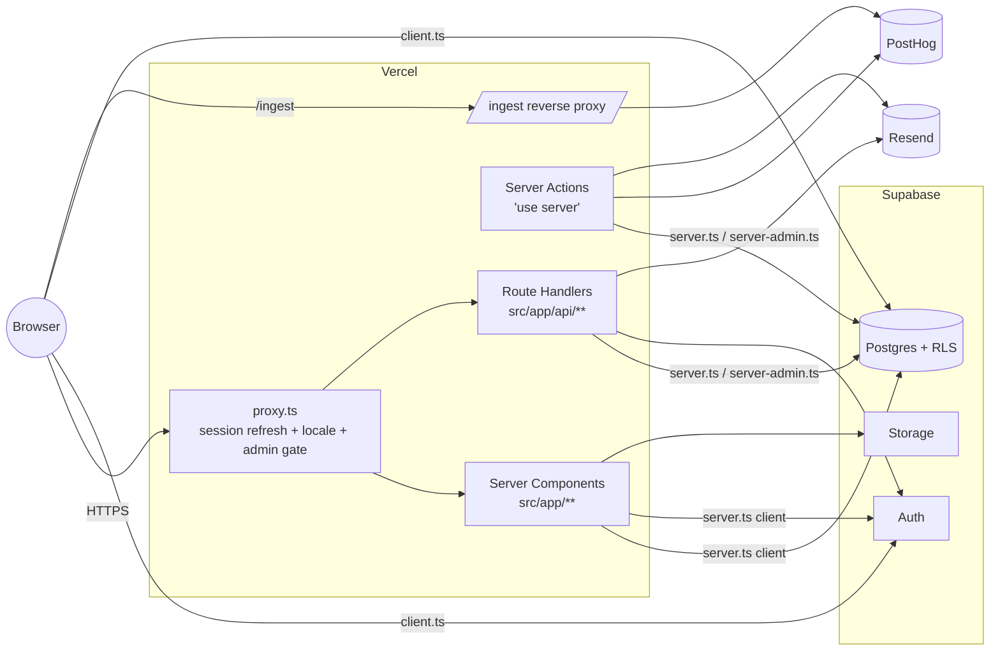
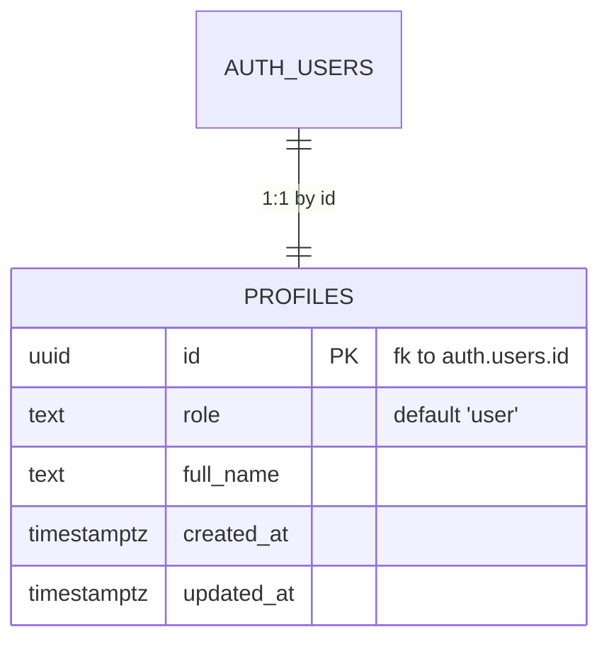

# Architecture

Living overview of how this template is wired. The source of truth is the code — when this drifts, fix the doc in the same PR.

## Stack

| Layer          | Tech                                             | Notes                                       |
| -------------- | ------------------------------------------------ | ------------------------------------------- |
| Framework      | Next.js 16 (App Router, Turbopack)               | Server Components first                     |
| Runtime        | Node 22 + request proxy                          | `.nvmrc` pins                               |
| UI             | React 19, Tailwind v4, shadcn/ui (radix-nova)    | CSS-first `@theme`                          |
| Type system    | TypeScript 5.6+ strict                           | `noUncheckedIndexedAccess`, `exactOptional` |
| Data / Auth    | Supabase (`@supabase/ssr`)                       | Browser / server / admin clients            |
| Env validation | `@t3-oss/env-nextjs` + zod                       | Boot-time fail-fast                         |
| i18n           | next-intl v4 (`en` / `pt` / `es`)                | `localePrefix: as-needed`                   |
| Analytics      | PostHog (client + server, proxied via `/ingest`) | `track()` / `trackServer()` wrappers        |
| Email          | Resend + react-email                             | Server-only                                 |
| Tests          | Vitest + RTL + Playwright                        | Determinism mandatory                       |
| Quality gate   | ESLint 9 flat + Prettier 3 + Husky + commitlint  | `npm run qa` is the gate                    |

## Request flow

## Data model (initial)

The `profiles` table is created and policy-guarded by `supabase/migrations/20260515003000_profiles_role.sql`. Role changes are blocked for non-admins by a trigger; new auth users get a profile row via `handle_new_user`.

## Trust boundaries

Data is validated/policed at FOUR layers, in this order, and each layer assumes the next one is hostile:

1. **`src/env.ts`** — t3-env + zod. The build fails if a required variable is missing or malformed.
2. **`src/proxy.ts`** — runs for matched requests: refreshes Supabase session cookies, enforces locale routing, and redirects unauthenticated users away from gated routes. For the admin tree it also checks the profile role so a bad cookie cannot reach the layout.
3. **RLS on every Supabase table** — even the service-role bypass is only used by code marked `import "server-only"` in `src/supabase/server-admin.ts`. Browser and edge clients use anon key + RLS exclusively.
4. **Server-side zod** — server actions and route handlers re-validate every input with zod, regardless of client-side validation. The shape that hits the DB is always the shape the schema says it is.

## Deploy topology

- **Vercel** runs Next.js (Server Components, Server Actions, Route Handlers), the request proxy, and Vercel Cron when configured.
- **Supabase** runs Postgres (with RLS), Auth (JWT cookies), Storage (S3-compatible), and Edge Functions if/when added.
- **PostHog** receives events through the Next.js `/ingest` reverse-proxy (configured in `next.config.ts`) so adblockers don't strip telemetry and the third-party origin doesn't leak via `Referer`.
- **Resend** is server-only; the API key never reaches the browser.

CI/CD: GitHub Actions runs `ci.yml` (lint + typecheck + build + unit) and `e2e.yml` (Playwright) on PR; `slack-release-notify.yml` posts on push to `main`.

## Related docs

- `.docs/nextjs-conventions.md` — Next.js 16 do/don't sheet.
- `.agents/rules/supabase.md` — DB conventions.
- `.agents/rules/security.md` — four-layer defense in detail.
- `.agents/rules/performance.md` — bundle / Web Vitals targets.
