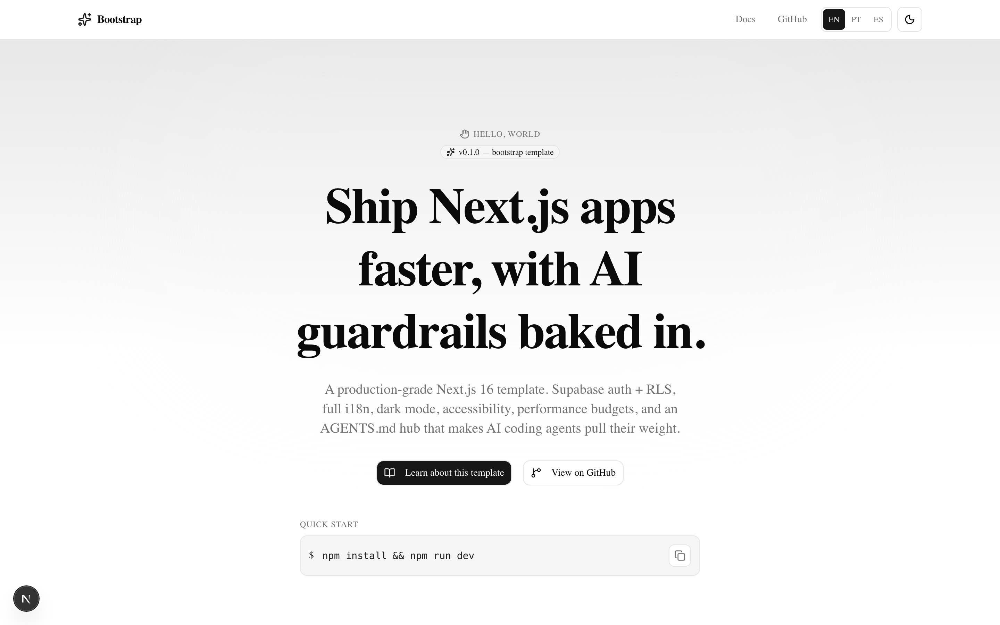
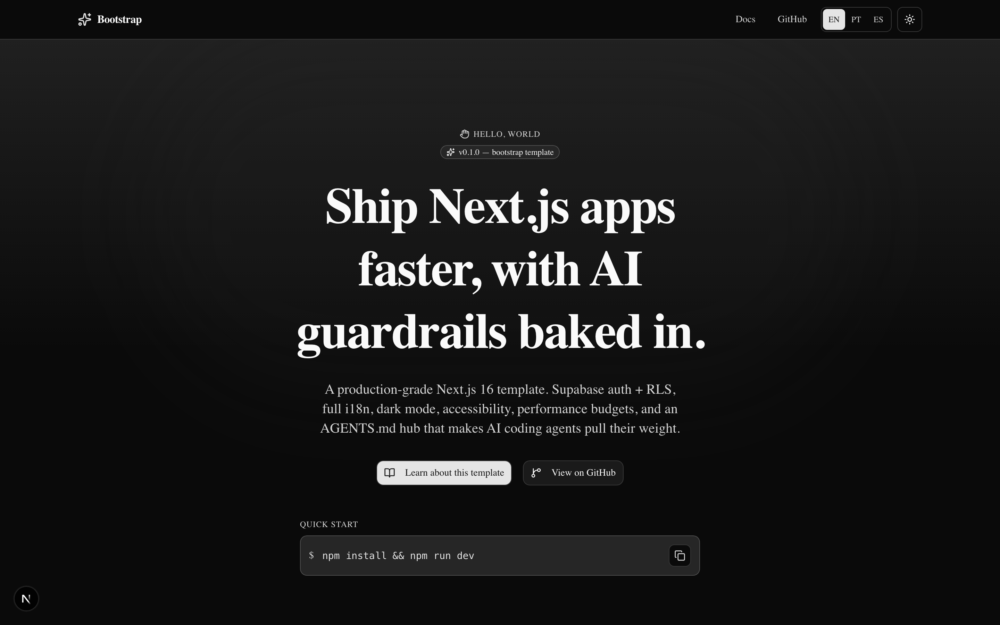
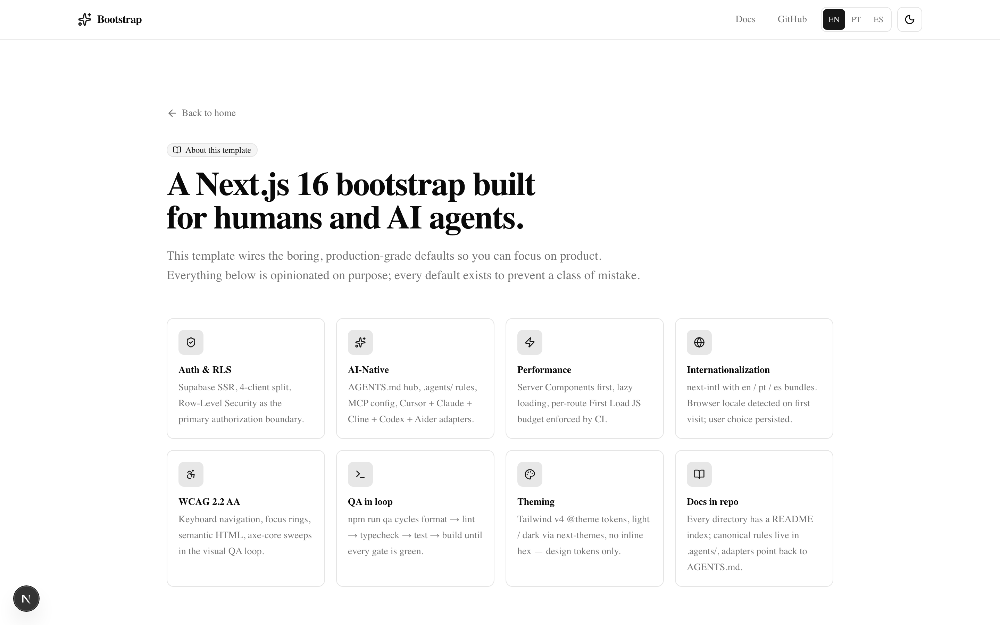
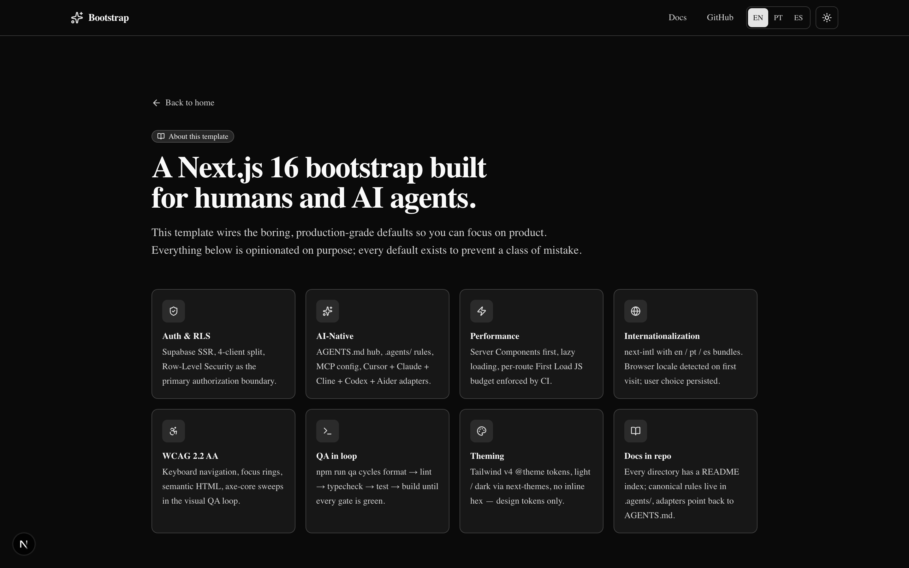
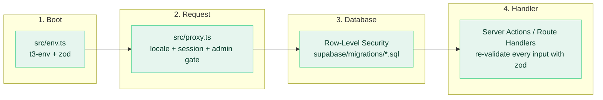
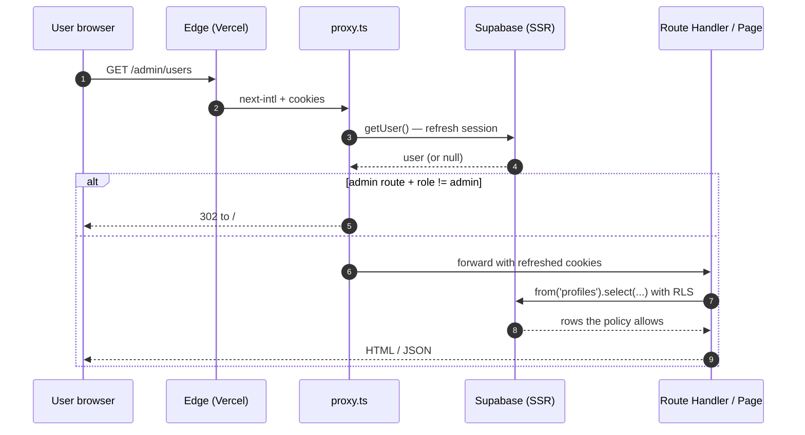
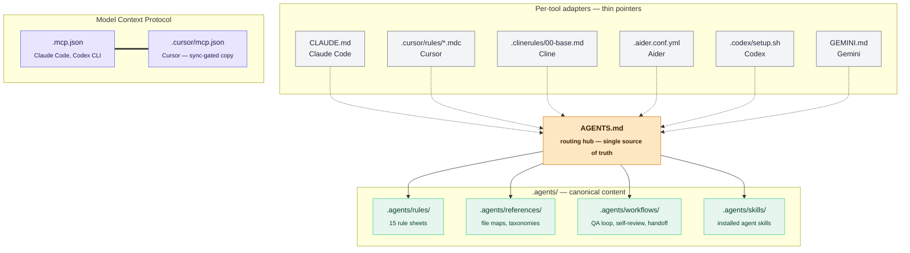

<div align="center">

# nextjs-bootstrap-template

**Open-source, agent-ready starter for production Next.js apps.**

Next.js 16 + React 19 + TypeScript strict + Tailwind v4 + shadcn/ui + Supabase + i18n + analytics + email + deterministic QA loops + first-class instructions for AI coding agents.

[](https://github.com/Jailsom-Nogueira/nextjs-bootstrap-template/actions/workflows/ci.yml)
[](https://github.com/Jailsom-Nogueira/nextjs-bootstrap-template/actions/workflows/e2e.yml)
[](./LICENSE)
[](./.nvmrc)
[](https://github.com/Jailsom-Nogueira/nextjs-bootstrap-template/generate)

[](https://nextjs.org)
[](https://react.dev)
[](https://www.typescriptlang.org)
[](https://tailwindcss.com)
[](https://ui.shadcn.com)
[](https://supabase.com)
[](https://posthog.com)
[](https://resend.com)
[](https://zod.dev)
[](https://vitest.dev)
[](https://playwright.dev)
[](https://www.w3.org/WAI/WCAG22/quickref/)
[](https://www.conventionalcommits.org)



<sub>Light + dark, three locales (en / pt / es), accessible by default. <a href="./.docs/assets/home-dark-desktop.png">See dark</a> · <a href="./.docs/assets/about-light-desktop.png">/about page</a></sub>

</div>

---

## Why this template

Spend a sprint making the boring decisions exactly once, then ship product. Every default exists to prevent a class of mistake:

- **Auth & RLS** — Supabase SSR with a 4-client split. Row-Level Security is the primary authorization boundary.
- **AI-Native** — `AGENTS.md` hub, `.agents/` rules, MCP config, Cursor / Claude / Cline / Codex / Aider adapters. New AI coding agent? It already knows how to behave here.
- **Performance** — Server Components first, lazy loading, Core Web Vitals targets, per-route First Load JS budget enforced by CI.
- **i18n** — English, Portuguese, Spanish wired via next-intl. Browser locale detected on first visit, user choice persisted in `NEXT_LOCALE` cookie.
- **Accessibility** — WCAG 2.2 AA defaults: keyboard nav, focus rings, semantic HTML, axe-core sweeps in the visual QA loop.
- **QA in loop** — `npm run qa` runs format → text hygiene → mcp-sync → lint → typecheck → test → build, cheapest first. The same script runs in CI. Local green = remote green.

## Table of contents

- [Quick start](#quick-start)
- [Screenshots](#screenshots)
- [Architecture](#architecture)
- [Agent surface](#agent-surface)
- [Project structure](#project-structure)
- [Scripts](#scripts)
- [Environment variables](#environment-variables)
- [Internationalization](#internationalization)
- [Admin panel](#admin-panel)
- [CI/CD and deployment](#cicd-and-deployment)
- [AI agents: start here](#ai-agents-start-here)
- [Contributing and license](#contributing-and-license)

## Quick start

### Use this template

The recommended path is to generate a fresh repo from the template. From GitHub: click **Use this template** at the top of [the repo page](https://github.com/Jailsom-Nogueira/nextjs-bootstrap-template/generate). From a terminal with the GitHub CLI:

```bash
gh repo create my-app --template Jailsom-Nogueira/nextjs-bootstrap-template --public --clone
cd my-app
cp .env.example .env.local        # fill at least the two NEXT_PUBLIC_SUPABASE_* keys
nvm use                           # picks Node 22 from .nvmrc
npm install
npm run qa                        # green = ready to ship
npm run dev                       # http://localhost:3000
```

### After generating

Update these files for your product before shipping:

- `package.json` — `name`, `description`, `repository`, `bugs`, `homepage`, `author`.
- `LICENSE` and `README.md` — maintainer details if ownership changes.
- `.github/CODEOWNERS` — your owning user or team.
- `.env.example` and `NEXT_PUBLIC_REPOSITORY_URL` — your repository URL.
- `messages/{en,pt,es}.json` — user-facing text.

## Screenshots

<table>
<tr>
<td align="center" width="50%"><strong>Home — light</strong></td>
<td align="center" width="50%"><strong>Home — dark</strong></td>
</tr>
<tr>
<td></td>
<td></td>
</tr>
<tr>
<td align="center" width="50%"><strong>About — light</strong></td>
<td align="center" width="50%"><strong>About — dark</strong></td>
</tr>
<tr>
<td></td>
<td></td>
</tr>
</table>

Theme defaults match the user's system preference; the in-app toggle persists the override. Three locales (en / pt / es); language switcher is an inline segmented control in the header.

## Architecture

### Defense in depth — four security layers



Each layer fails closed: an attacker has to defeat all four. See [`CONCEPTS.md`](./CONCEPTS.md) for the why behind each. Deeper sequence and ER diagrams live in [`.docs/architecture.md`](./.docs/architecture.md).

### Request flow



## Agent surface

This repo is designed so AI coding agents pull their weight on day one. The hub is [`AGENTS.md`](./AGENTS.md). Every per-tool config is a thin adapter that points back to it.



**Rule:** canonical content lives in `.agents/`. Per-tool files are thin adapters that auto-attach by glob (where supported) and point back to AGENTS.md — they do not duplicate rule content. Obligatory duplication (`.mcp.json` ↔ `.cursor/mcp.json`, because Cursor only reads its own path) is guarded by the `mcp-sync` QA gate. Full conventions: [`.agents/references/repo-structure.md`](./.agents/references/repo-structure.md).

## Project structure

The repo is intentionally flat at the top level. Every agent-facing directory has a `README.md` index that lists its contents and points back to AGENTS.md.

| Directory      | What lives here                                                                                                         |
| -------------- | ----------------------------------------------------------------------------------------------------------------------- |
| `.agents/`     | Canonical rules, references, workflows, skills. Cross-linked from AGENTS.md.                                            |
| `.claude/`     | Claude Code slash commands (`/spec`, `/plan`, `/qa`, `/migration`, `/component`, `/prompt-context`).                    |
| `.clinerules/` | Cline base rules (thin pointer to AGENTS.md).                                                                           |
| `.codex/`      | Codex Cloud sandbox bootstrap.                                                                                          |
| `.cursor/`     | Cursor MCP config + auto-attaching rule stubs.                                                                          |
| `.docs/`       | Durable docs: architecture, conventions, ADRs, runbooks, specs, templates, README assets, full repo tree.               |
| `.github/`     | CI workflows (`ci.yml`, `e2e.yml`), issue / PR templates, CODEOWNERS, Dependabot.                                       |
| `.husky/`      | Git hooks: `commit-msg` (commitlint), `pre-commit` (lint-staged), `pre-push` (typecheck + CHANGELOG gate).              |
| `.plans/`      | Active implementation plans. Completed plans move to `.plans/archived/`.                                                |
| `e2e/`         | Playwright tests (`smoke`, `admin-gate`) + fixtures + global setup.                                                     |
| `emails/`      | react-email preview entry points; canonical templates live under `src/lib/email/templates/`.                            |
| `messages/`    | next-intl translation bundles (`en.json` / `pt.json` / `es.json`). Add new keys to all three in one commit.             |
| `scripts/`     | QA loop, hygiene checks, mcp-sync, bundle budget, type generation, changelog generation, visual QA.                     |
| `src/`         | Application source: App Router, components, lib, hooks, supabase clients, i18n. See [`src/README.md`](./src/README.md). |
| `supabase/`    | Supabase CLI config + SQL migrations + `seed.sql`.                                                                      |

<details>
<summary><strong>Full annotated tree</strong> (250+ lines)</summary>

See [`.docs/repo-tree.md`](./.docs/repo-tree.md) for every tracked file with a one-line purpose.

</details>

## Scripts

The full lane is `npm run qa` (fix-until-green, cheapest gate first, stops at first failure). The fast lane for inner-loop iteration is `npm run test:agent` (vitest `--changed`, no coverage).

| Script            | What it does                                                                                |
| ----------------- | ------------------------------------------------------------------------------------------- |
| `dev`             | Next dev server (Turbopack).                                                                |
| `build`           | Production build.                                                                           |
| `qa`              | **Definition of done.** Format → text-hygiene → mcp-sync → lint → typecheck → test → build. |
| `qa:strict`       | Above + Playwright E2E + bundle budget + visual QA sweep.                                   |
| `qa:visual`       | Route × locale × theme × viewport sweep with axe-core (WCAG 2.2 AA).                        |
| `test:agent`      | Fast lane: vitest on changed files only.                                                    |
| `test:e2e`        | Playwright (chromium + webkit).                                                             |
| `lint` / `format` | ESLint 9 flat config / Prettier 3 with class sort.                                          |
| `typecheck`       | `tsc --noEmit` against TS strict mode.                                                      |
| `db:types`        | Regenerate Supabase types into `src/supabase/database.types.ts`.                            |
| `prompt:context`  | Print a paste-ready project snapshot for chat-UI agents.                                    |
| `email:dev`       | react-email preview server (renders `emails/*.tsx`).                                        |
| `push`            | Auto-generate CHANGELOG, bump patch version, commit, push.                                  |

<details>
<summary>Full script list</summary>

| Script                                     | What it does                                               |
| ------------------------------------------ | ---------------------------------------------------------- |
| `start`                                    | Run prod build.                                            |
| `lint:fix`                                 | ESLint with autofix.                                       |
| `format:check`                             | Prettier check without writing.                            |
| `check:text-hygiene`                       | Reject decorative emoji / symbols in tracked text.         |
| `check:mcp-sync`                           | Fail if `.mcp.json` and `.cursor/mcp.json` drift.          |
| `check`                                    | text-hygiene + mcp-sync + lint + typecheck + format:check. |
| `ci-check`                                 | check + test + build.                                      |
| `qa:quiet`                                 | QA loop with minimal output.                               |
| `test`                                     | Vitest run (all tests).                                    |
| `test:watch` / `test:ui` / `test:coverage` | Vitest variants.                                           |
| `test:e2e:ui`                              | Playwright interactive mode.                               |
| `analyze`                                  | Production build with `@next/bundle-analyzer`.             |
| `pack`                                     | Build a single repomix XML at `.agent-cache/repomix.xml`.  |
| `commit`                                   | Manual commitlint check.                                   |
| `prepare`                                  | Husky install hook.                                        |

</details>

## Environment variables

All env is validated at boot by [`src/env.ts`](./src/env.ts) (t3-env + zod). The build fails fast if a required var is missing — no silent `undefined` reaching prod.

| Name                            | Required                | Description                             |
| ------------------------------- | ----------------------- | --------------------------------------- |
| `NEXT_PUBLIC_SITE_URL`          | yes (default localhost) | Public origin.                          |
| `NEXT_PUBLIC_SUPABASE_URL`      | **yes**                 | Supabase project URL.                   |
| `NEXT_PUBLIC_SUPABASE_ANON_KEY` | **yes**                 | Supabase anon key.                      |
| `SUPABASE_SERVICE_ROLE_KEY`     | optional                | Admin client (server-only).             |
| `SUPABASE_PROJECT_REF`          | optional                | For `npm run db:types`.                 |
| `NEXT_PUBLIC_POSTHOG_KEY`       | optional                | Enables analytics.                      |
| `NEXT_PUBLIC_POSTHOG_HOST`      | optional                | Defaults to `/ingest` reverse proxy.    |
| `POSTHOG_API_KEY`               | optional                | Server-side PostHog (usually same key). |
| `RESEND_API_KEY`                | optional                | Enables email.                          |
| `EMAIL_FROM`                    | optional                | Default from address.                   |

## Internationalization

Three locales out of the box via [next-intl v4](https://next-intl.dev):

| Code | Language           | URL prefix     |
| ---- | ------------------ | -------------- |
| `en` | English (en-us)    | none (default) |
| `pt` | Portuguese (pt-br) | `/pt`          |
| `es` | Spanish (es-es)    | `/es`          |

**Locale detection contract:** `localePrefix: "as-needed"` keeps the default locale at the root. On a first visit with no cookie, the proxy reads `Accept-Language` and redirects to the best match. The in-app segmented switcher writes a `NEXT_LOCALE` cookie that takes precedence forever after — browser default first time, user choice persisted thereafter.

To add a locale: add the code to [`src/i18n/routing.ts`](./src/i18n/routing.ts), drop a new bundle in `messages/`, add a label under `locale.<code>` to **all** existing bundles. Full rule sheet: [`.agents/rules/i18n.md`](./.agents/rules/i18n.md).

## Admin panel

Bundled migration creates `public.profiles` with a `role text check ('user' | 'admin')` column, RLS policies (select-own-or-admin, update-own), a `guard_profile_role_change` trigger that blocks non-admins from changing the role column, and a `handle_new_user` trigger that auto-creates a profile row for every new `auth.users` insert.

**Gate is defense in depth:** the proxy redirects non-admins, AND the admin layout calls `isAdmin()` on the server to double-check.

Make a user admin (dev): `update public.profiles set role = 'admin' where id = '<uuid>';`. Don't need an admin panel? Remove the migration + `src/lib/auth/is-admin.ts` + `src/app/[locale]/(admin)/` + the `admin-gate` e2e spec. Full rules: [`.agents/rules/admin.md`](./.agents/rules/admin.md).

## CI/CD and deployment

`.github/workflows/`:

- `ci.yml` — runs `npm run qa` on every PR and push to `main`. Same script you run locally; no CI-only checks.
- `e2e.yml` — Playwright (chromium + webkit) on every PR; uploads HTML report as artifact.
- `slack-release-notify.yml` — posts version + recent commits to Slack on push to `main`. Skipped silently without `SLACK_WEBHOOK_URL`.

**Branch protection:** the `main` ruleset blocks deletion, blocks force-push, and requires the `qa` and `playwright` status checks to pass before merging a PR. See [Settings → Rules](https://github.com/Jailsom-Nogueira/nextjs-bootstrap-template/rules).

**Deployment:** built for Vercel. `vercel link`, then add every env from `.env.example` to Production + Preview environments. Push to `main` via `npm run push` → auto-deploy. Other platforms (Fly, Railway) work — just provide Node 22 and the env vars.

## AI agents: start here

1. Read [`AGENTS.md`](./AGENTS.md) — it's the routing hub, not a giant rule dump.
2. Infer the task type from files, symptoms, active plans, the diff, and the requested output.
3. Load task-specific rules from `.agents/rules/` before editing.
4. Read [`CONCEPTS.md`](./CONCEPTS.md) if a term or convention is unfamiliar.
5. Use `npm run prompt:context` to print a paste-ready project snapshot for chat-UI agents.
6. **Definition of done** for repo-changing work is `npm run qa` exit 0; UI/browser-facing work also needs `npm run qa:visual`.

### MCP servers

[`.mcp.json`](./.mcp.json) and a sync-gated copy at [`.cursor/mcp.json`](./.cursor/mcp.json) wire three Model Context Protocol servers:

| Server       | What it does                                                        |
| ------------ | ------------------------------------------------------------------- |
| `supabase`   | Inspect schema, run RO queries on your linked Supabase project.     |
| `playwright` | Drive a real browser for e2e / visual checks from inside the agent. |
| `context7`   | Pull up-to-date library docs by request.                            |

Supabase starts in `--read-only` mode. To enable write mode locally, edit `.mcp.json` and remove `--read-only` — do NOT commit that change. Set `SUPABASE_ACCESS_TOKEN` in your environment first ([dashboard tokens](https://supabase.com/dashboard/account/tokens)).

## Contributing and license

- Author and maintainer: Jailsom Nogueira.
- Contributions: see [`CONTRIBUTING.md`](./CONTRIBUTING.md).
- Security issues: see [`SECURITY.md`](./SECURITY.md).
- Template consumers: replace CODEOWNERS, package metadata, repository URL, product copy, and environment values for your generated app.

License: [MIT](./LICENSE) © 2026 Jailsom Nogueira.
